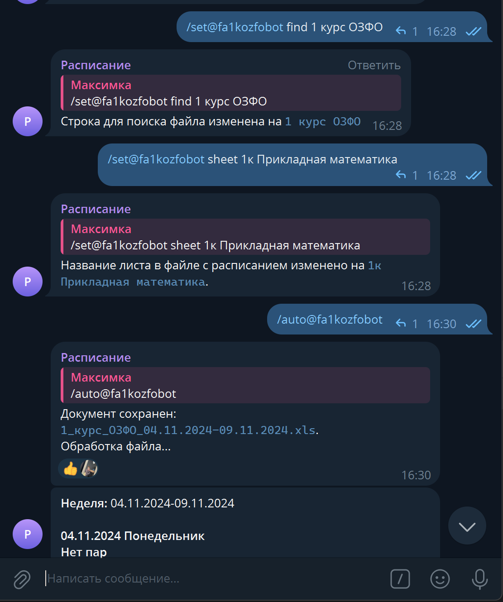

# fa-bot

Бот для Telegram. Позволяет получать и формировать расписание занятий для группы.

## Установка

1. Установите Python 3.10 или выше.
2. Установите зависимости:
    ```bash
    pip install -r requirements.txt
    ```
3. 1 раз запустите бота:
    ```bash
    python main.py
    ```
4. Введите токен бота, который вы получили у [@BotFather](https://t.me/BotFather) в `config.json`.
5. Перезапустите бота:
    ```bash
    python main.py
    ```
6. Добавьте бота в группу и дайте ему права администратора.
7. Готово!

## Использование

### Команды

- `/start` - начать работу с ботом.
- `/help` - получить справку о боте.
- `/set <команда> <значение>`
  - Команды:
    - `url` - установить URL страницы с расписанием\
    - `find` - установить строку для поиска файла\
    - `sheet` - установить название листа в файле с расписанием\
- `/setting` - получить текущие настройки бота в чате.
- `/auto` - автоматический поиск файла с расписанием.
- `/file` - ручной поиск файла с расписанием. Надо ответить на сообщение с файлом.

### Пример
